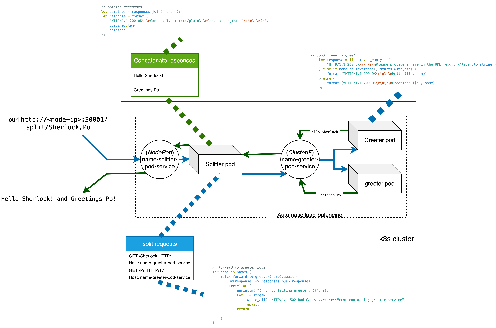

## K3s-Demo: wasm-pods-communication

### How it works :


### Setup
#### 1. Build the images for splitter and greeter pods
```sh
cd name-greeter-pod
rm -fr Cargo.lock && cargo clean
cargo build --target wasm32-wasip1 --release
cd target/wasm32-wasip1/release
oci-tar-builder --name name-greeter-pod \
    --repo ghcr.io/second-state \
    --tag latest \
    --module ./name-greeter-pod.wasm \
    -o ./img-oci-1.tar
sudo k3s ctr image import --all-platforms ./img-oci-1.tar
cd ..
cd name-splitter-pod
rm -fr Cargo.lock && cargo clean
cargo build --target wasm32-wasip1 --release
cd target/wasm32-wasip1/release
oci-tar-builder --name name-splitter-pod \
    --repo ghcr.io/second-state \
    --tag latest \
    --module ./name-splitter-pod.wasm \
    -o ./img-oci-2.tar
sudo k3s ctr image import --all-platforms ./img-oci-2.tar
sudo k3s ctr images ls # verify
cd ..
```

#### 2. Configure in k3s 
  - 2 `name-greeter-pod` (listening on port 80) deployment
    - ClusterIP service `name-greeter-pod-service` exposed at port=70 with targetport=80
  - 1 `name-splitter-pod` (listening on port 90) deployment
    - NodePort service `name-splitter-pod-service` exposed at nodePort: 30001 with targetport=90
```sh
# refer the deployment.yaml and..
k3s kubectl apply -f deployment.yaml
k3s kubectl get all # verify
# all pods and services work as intended
```

#### 3. Query the splitter container
```sh
curl http://<node's-internal-ip>:30001/split/Sherlock,Po
# o/p :
# Hello Sherlock! and Greetings Po!

# if greeters are configured for NodePort service, then they behave exactly as intended :
curl http://<node's-internal-ip>:30002/Aang
# output :
# Greetings Aang
```

#### 4. Load balancing also works :
```sh
$ kubectl logs name-greeter-pod-deployment-659c98c5fc-5wzrz
Server listening on address: 0.0.0.0:80
Handling connection from: 0.0.0.0:58688
Completed handling connection from 0.0.0.0:58688
Handling connection from: 0.0.0.0:58702
Completed handling connection from 0.0.0.0:58702
Handling connection from: 0.0.0.0:45876
Completed handling connection from 0.0.0.0:45876

$ kubectl logs name-greeter-pod-deployment-659c98c5fc-94c69
Server listening on address: 0.0.0.0:80
Handling connection from: 0.0.0.0:49056
Completed handling connection from 0.0.0.0:49056
Handling connection from: 0.0.0.0:49064
Completed handling connection from 0.0.0.0:49064
Handling connection from: 0.0.0.0:45880
Completed handling connection from 0.0.0.0:45880
```